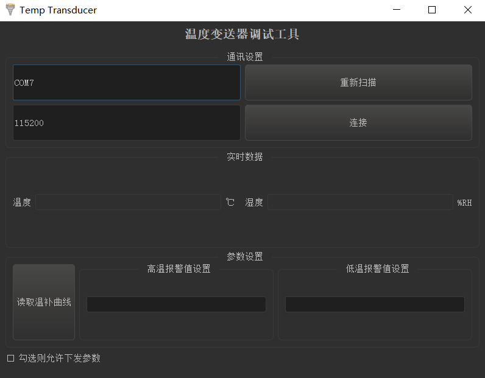

# Temp_Transducer_Tool

## 编译环境

qt：Qt5.12.10

qtcreator：4.4.1

## 软件界面

## 软件使用

1、串口工具（CH340或者其他）连接电脑

2、扫描串口号，找到对应串口设备

3、串口设备硬件连接设备端（modbus从机）

4、点击软件上的连接按钮，设备自动进入实时温湿度轮询

5、当需要下发高低温报警值时，勾选左下角，设备将停止轮询，等待点击下发参数，需要注意的是，重复点击下发按钮无效（软件将检测设置参数是否变化，无变化不允许下发）

6、取消勾选后设备自动恢复轮询状态
